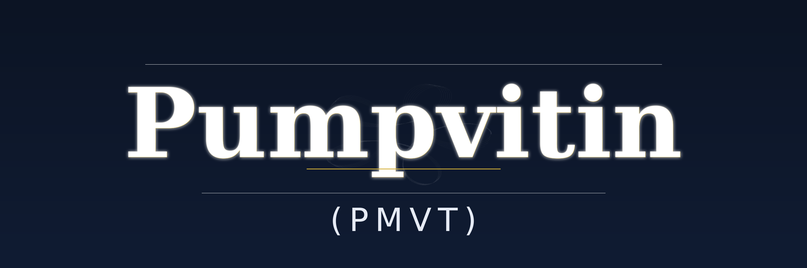

  

  
  
  

  

---

# 🌐 Pumpvitin (PMVT) – The legal drug for your portfolio 💊  

**Not meth. Not vitamins. Just Pumpvitin.💊🚀**  

---

## 🔥 About the Project  

Pumpvitin is not just another coin. It’s a legal drug for everyone trying to survive market boredom.  
Forget vitamins – they won’t get you high.  
Forget meth – that one gets you jailed.  
We created **Pumpvitin** – the first meme-pill that doesn’t eat your life, but pumps your chart. 📈💊  

When people laugh, they share. When they share, we grow. And when we grow, the chart goes 🚀.  
Side effects? Laughter, FOMO, and dangerously green candles.  

---

## 💊 Tokenomics  

- **Total Supply:** Enough pills to overdose the whole market 💊  
- **Prescription:** One pill a day keeps the bear away 🐻❌  
- **Burn Mechanism:** Every coffee a trader drinks = 1 pill burned ☕🔥  
- **Utility:**  
  - Absence = withdrawal (dump 📉)  
  - Overdose = euphoria (pump 📈)  
  - Side effects: laughter, FOMO, and dangerously green charts 🚀 

---

## 🎮 Gamification  

Every holder becomes a patient in the Pumpvitin™ clinic.  
The more you hold, the crazier your diagnosis:  

- 🍼 **Baby Pumper** – first dose is free  
- 💊🪽 **Winged Pill** – still laughing even when the chart is red  
- 💊💀 **Overdose Holder** – you’ll never sell, not even at the end of the world  
- 🧟 **Zombie Trader** – you should’ve sold long ago, but you can’t  
- 👑 **Doctor Pumpstein** – handing out pills instead of taking them  

---

## 🎭 Meme War Strategy  

We are not traders. We are meme junkies on Pumpvitin. 💊  
We don’t chase profits – profits chase us.  
Our memes hit harder than regulations.  
Our shitposts spread faster than viruses.  
Our humor is darker than your portfolio at -90%.  

We don’t fight with charts.  
We overdose markets with laughter.  
And every time you laugh, another candle turns green. 📈😂  

Pumpvitin is not just a coin – it’s a psychological weapon.  
Join the Meme Army, or stay sober and watch us pump without you. 🚀   

---

## 🌍 Community  

Welcome to the Pumpvitin Rehab™.  
Here we don’t cure addictions – we create new ones.  
Your prescription:  

- 🐦 [Twitter/X](https://x.com/pumpvitin) = daily dose of memes  
- 💬 [Telegram](https://t.me/pumpvitin) = group therapy for degens  
- 💻 [PumpFun](https://pump.fun/coin/C6DKbkhRMn6xT5vghR2SXQ5PWA5vNedWXN9rXTnCpump) = the dealer’s corner where you get your stash  

Join, laugh, overdose. 💊😂🚀  

---

## 🧠 Why It Works  

Pumpvitin works because your brain is weak.  
You don’t buy fundamentals – you buy dopamine.  
Memes spread faster than news.  
Laughter travels quicker than FOMO.  
And people trust inside jokes more than governments.  

The truth is: everyone’s addicted anyway.  
Some to coffee, some to sugar, some to likes.  
We just made a new addiction that actually pays.  

Forget rehab. Embrace the meme overdose. 💊😂📈  

---

## 🧩 Survivor’s Manifesto  

I used to do drugs.  
I was a wreck – broken, penniless, meaningless. I thought “pump” only meant my heart racing after another line.  
The police knew me by name, neighbors laughed at me, and my family gave up on me.  

But then came the turning point.  
I realized that real drugs destroy the body, the mind, and the future.  
And that’s when I discovered a new substance: **Pumpvitin**.  

💊 Pumpvitin is not a drug.  
Pumpvitin is a **legal addiction**.  
It’s a pill that doesn’t eat your life – it pumps your chart.  

---

I remember my first day on Pumpvitin:  

- No fear of the law. 🚓  
- No paranoid thoughts. 🤯  
- Just a clean dose of dopamine and green candles on the chart. 📈  

And you know what? No one could take it away from me.  
No dealer. No judge. Just me and my community, laughing even on red days.  

---

Now I’m “clean.”  
I don’t lie on the floor anymore. I don’t drain my parents’ bank account. I don’t dig through my pockets for loose change to get the next hit.  
My only addiction is **Pumpvitin** – and this one doesn’t lead me to prison, but to wealth.  

They say:  
“Drugs control your mind and complicate your life.”  
I say:  
“Pumpvitin controls the chart and only complicates life for the competition.”  

---

💊 Pumpvitin is my salvation.  
Dark humor? Yes.  
Dark chart? Never again.  

Because when I replaced meth with Pumpvitin, a wreck turned into a trader.  

---

👉 And this is my message to everyone:  
If you want change, you don’t need detox.  
You just need one dose of Pumpvitin – and you’ll never quit.  

---

⚠️ **Warning:**  
Side effects may include: laughter, euphoria, FOMO, uncontrollable meme sharing, and dangerously green charts.  

---

  Legally addictive since 2025. 🚀💊

